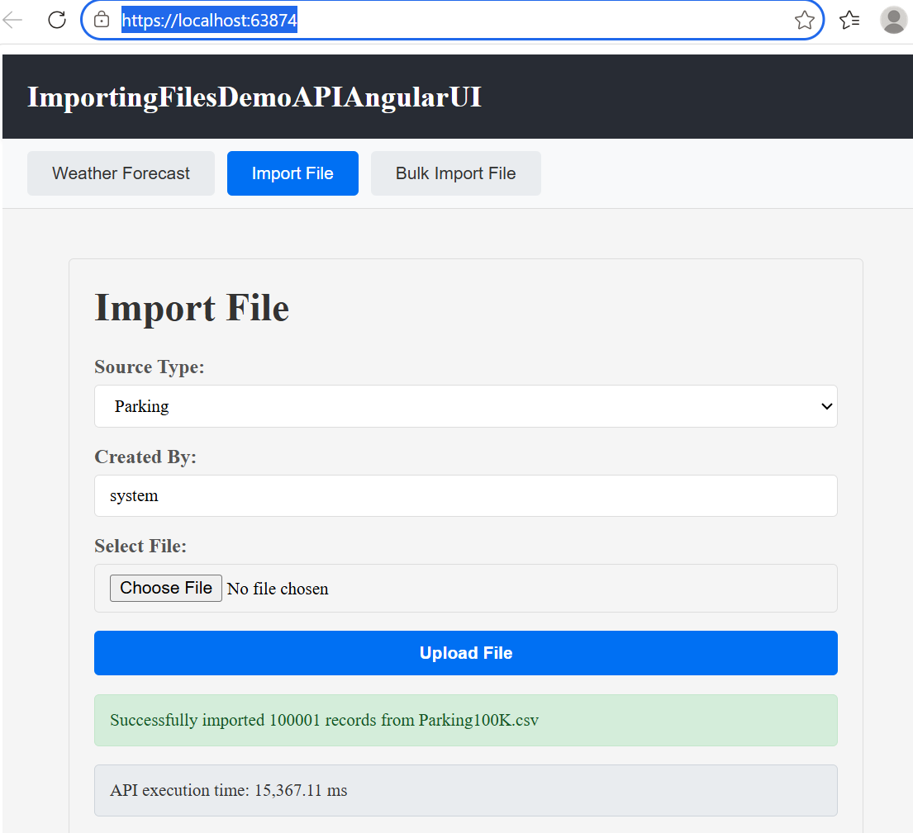
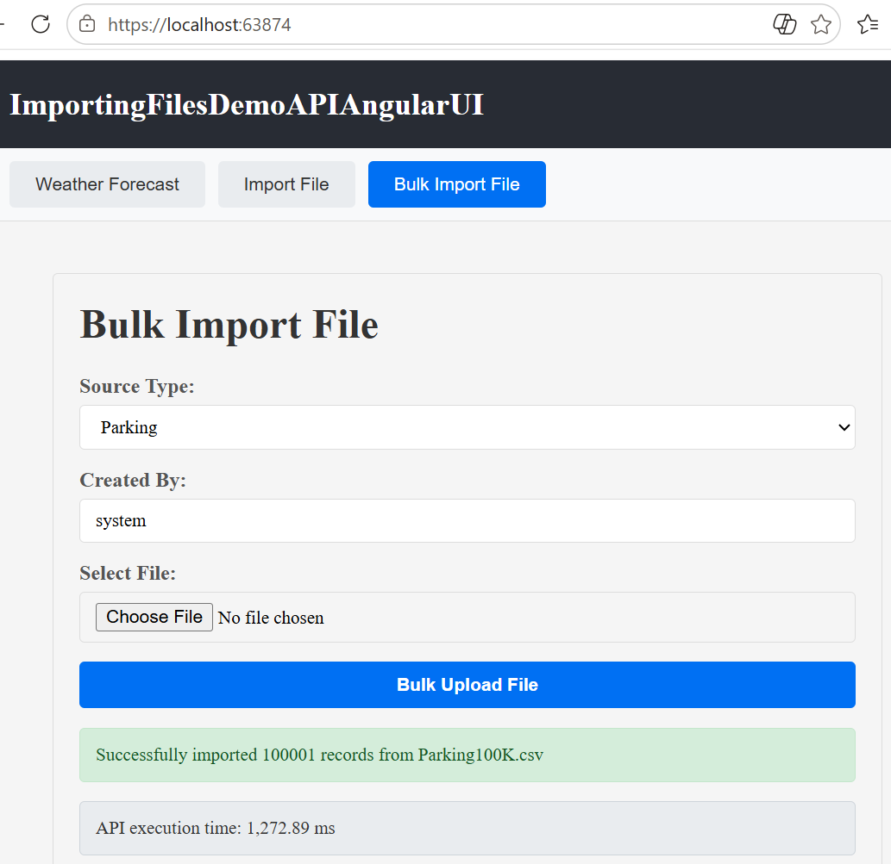
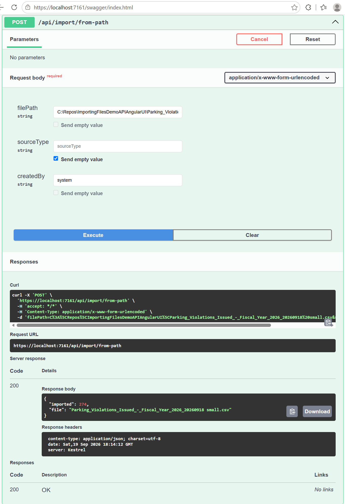
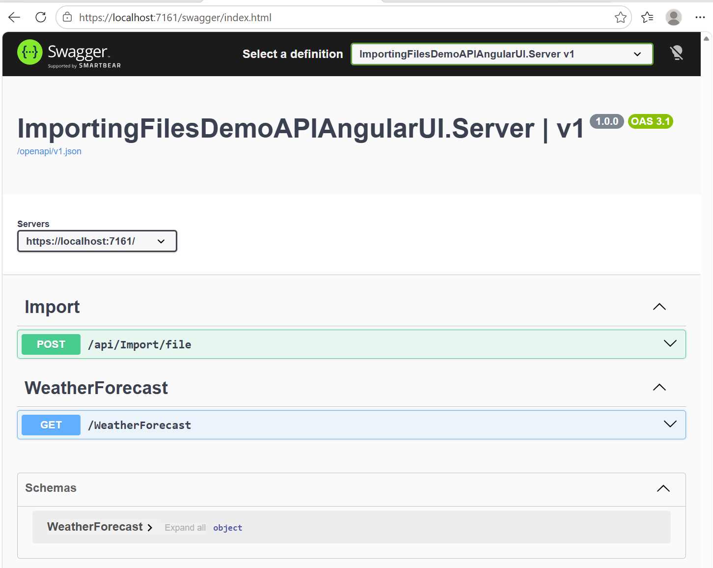
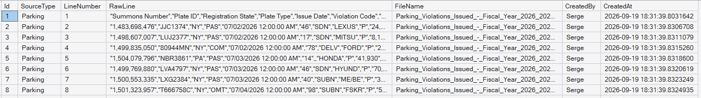
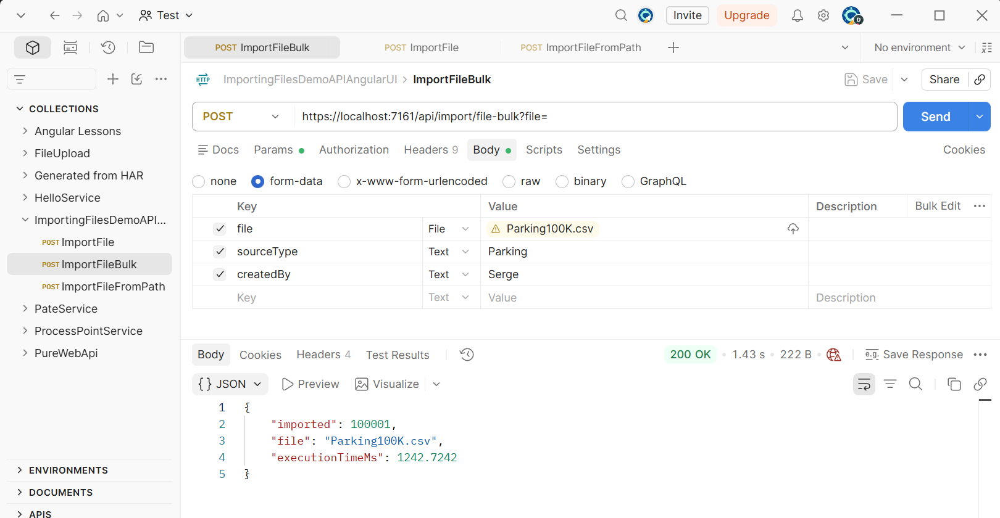

# Importing Files Demo API + Angular UI

This is a demo application consisting of an ASP.NET Core API and an Angular UI for uploading files and importing their contents into a SQL Server database. It also includes a development-only endpoint for importing a file from a server-side path.














Brief instructions to run the solution (server + client) and how to expose Swagger.

## Prerequisites
- .NET 10 SDK installed
- Node.js and npm
- (Optional) Trust the .NET dev certificate for HTTPS: `dotnet dev-certs https --trust`

## Run the API (server)
1. From the solution root you can run the server project directly:
   - dotnet restore
   - dotnet build
   - dotnet run --project ImportingFilesDemoAPIAngularUI.Server
   or open the solution in Visual Studio and start the Server profile.

2. Default dev ports used by this project (check ImportingFilesDemoAPIAngularUI.Server/Properties/launchSettings.json):
   - HTTPS API port: https://localhost:7161
   - HTTP API port: http://localhost:5109

## Run the client (Angular SPA)
1. Change to the client folder and install dependencies:
   - cd importingfilesdemoapiangularui.client
   - npm install

2. Start the dev server (on Windows `npm start` will run the appropriate script):
   - npm start

3. The SPA dev server runs on port 63874 by default: https://localhost:63874

## Accessing Swagger
- API Swagger UI (served by the API project):
  - https://localhost:7161/swagger

- To access Swagger through the SPA dev server (so the URL is https://localhost:63874/swagger) make sure the client dev server proxies `/swagger` and the OpenAPI JSON (`/openapi`) to the API. This project includes `src/proxy.conf.js` and the client package.json start scripts already reference the proxy, but verify:
  - importingfilesdemoapiangularui.client/src/proxy.conf.js contains `/swagger` and `/openapi` in its context array
  - importingfilesdemoapiangularui.client/package.json start scripts include `--proxy-config src/proxy.conf.js`
  - restart the SPA dev server after changes

## Adding or enabling Swagger in the API project
1. Add the package (if not present):
   - Microsoft.AspNetCore.OpenApi (use a version that targets .NET 10)

2. Register OpenAPI services and middleware in Program.cs:

```csharp
// Register the OpenAPI generator
builder.Services.AddOpenApi();

// Map and expose the OpenAPI document and Swagger UI (example below shows always-on; remove the `if` check to expose in non-development)
app.MapOpenApi();
app.UseSwaggerUI(options =>
{
	options.SwaggerEndpoint("/openapi/v1.json", "ImportingFilesDemoAPIAngularUI v1");
	options.RoutePrefix = "swagger";
});
```

3. Notes:
   - By default the template in this repo registers MapOpenApi() and UseSwaggerUI(...) only when the environment is Development. If you want Swagger available in other environments, move those calls out of the `if (app.Environment.IsDevelopment())` block.
   - The OpenAPI generator used by the ASP.NET templates exposes the document at `/openapi/v1.json` and the UI at `/swagger`.

## Troubleshooting
- If navigating to `https://localhost:63874/swagger` shows the Angular router error (NG04002), your SPA dev server is not proxying that path and is serving index.html instead. Restart the client dev server with the proxy enabled and confirm proxy.conf.js includes `/swagger` and `/openapi`.
- If the browser blocks requests due to certificate issues, either trust the dev certificate (see prerequisites) or set `secure: false` in the proxy config for local development (the client proxy file in this repo already uses `secure: false`).

## Database Setup

### Create the Phones database
Before running the API for the first time, create the Phones database in SQL Server.

**Option 1: Using SQL Server Management Studio (SSMS)**
1. Connect to your SQL Server instance
2. Right-click **Databases** → **New Database**
3. Name: `Phones`
4. Click **OK**

**Option 2: Using T-SQL**
```sql
CREATE DATABASE Phones;
```

**Option 3: Using sqlcmd (command line)**
```powershell
sqlcmd -S localhost -Q "CREATE DATABASE Phones;"
```

### Connection String Configuration
The API reads the connection string from `ImportingFilesDemoAPIAngularUI.Server/appsettings.Development.json`:

```json
{
  "ConnectionStrings": {
    "Phones": "Server=localhost;Database=Phones;Integrated Security=true;TrustServerCertificate=true"
  }
}
```

**Modify the connection string if:**
- SQL Server is on a different machine: Change `localhost` to server name/IP
- Using SQL Authentication: Replace `Trusted_Connection=True;` with `User Id=sa;Password=YourPassword;`
- Database is named differently: Change `Phones` to your database name

The API will automatically create the `dbo.FileImports` table on first use (no manual schema creation needed).

---

## Using the File Import API

### Endpoint 1: POST /api/import/file (file upload)
Imports a file by uploading its contents. This is the standard way and works from any client.

**Large file uploads:** The API is configured to accept multipart uploads up to **5 GB**, including files larger than the previous 100 MB endpoint limit. The 5 GB limit provides headroom for multipart request overhead when uploading a 4 GB file. Large uploads require sufficient temporary disk space on the API server and may take considerable time to complete.

When using the Angular development UI, restart the ASP.NET Core and Angular development servers after changing upload-limit configuration. Any reverse proxy or hosting service in front of the API must also allow request bodies of at least 5 GB and use suitable request timeouts.

**Parameters (what to fill in Swagger):**
- **file** — Select the actual file from your computer (click the file input box)
- **sourceType** — File category, e.g., `Parking`, `Driving`
- **createdBy** — Username (defaults to `system`)

**Example curl:**
```bash
curl -k -X POST "https://localhost:7161/api/import/file" \
  -F "file=@Parking_Violations_Issued_-_Fiscal_Year_2026_20260918_small.csv" \
  -F "sourceType=Parking" \
  -F "createdBy=system"
```

**Example curl for a large file using the bulk import endpoint (PowerShell):**
```powershell
curl.exe -k -X POST "https://localhost:7161/api/import/file-bulk" `
  -F "file=@C:\Repos\ImportingFilesDemoAPIAngularUI\Parking_Violations_Issued_-_Fiscal_Year_2026_20260918 big.csv" `
  -F "sourceType=Parking" `
  -F "createdBy=system"
```

Use `curl.exe` rather than the PowerShell `curl` alias. The `file` form value must include `@` before the full file path.

**Example Swagger usage:**
1. Open https://localhost:7161/swagger
2. Find **POST /api/import/file**
3. Click **"Try it out"**
4. Click the blue file input box — opens a system file picker dialog
   - Browse and select your CSV file
5. Enter `Parking` in **sourceType** field
6. Enter `system` in **createdBy** field
7. Click **"Execute"**

---

### Endpoint 2: POST /api/import/from-path (local file path)
**Development/testing only** — Reads directly from a file path on the server. Simpler for local testing since you don't need to upload.

**Parameters:**
- **filePath** — Full file path on the server
  - Windows: `C:\Repos\ImportingFilesDemoAPIAngularUI\Parking_Violations_Issued_-_Fiscal_Year_2026_20260918 small.csv`
  - Linux/Mac: `/home/user/data/parking.csv`
- **sourceType** — File category, e.g., `Parking`, `Driving`
- **createdBy** — Username (defaults to `system`)

**Example curl (Windows):**
```powershell
curl -k -X POST "https://localhost:7161/api/import/from-path" `
  -F "filePath=C:\Repos\ImportingFilesDemoAPIAngularUI\Parking_Violations_Issued_-_Fiscal_Year_2026_20260918 small.csv" `
  -F "sourceType=Parking" `
  -F "createdBy=system"
```

**Example Swagger usage:**
1. Open https://localhost:7161/swagger
2. Find **POST /api/import/from-path**
3. Click **"Try it out"**
4. Fill in **filePath** with the full path: `C:\Repos\...\your_file.csv`
5. Fill in **sourceType**: `Parking`
6. Fill in **createdBy**: `system`
7. Click **"Execute"**

**WARNING:** This endpoint is for development only and should not be used in production, as it allows direct file system access from clients.

---

### Response
Both endpoints return:
```json
{
  "imported": 150,
  "file": "Parking_Violations_small.csv"
}
```

Or on error:
```json
{
  "type": "https://tools.ietf.org/html/rfc9110#section-15.5.1",
  "title": "Import failed",
  "status": 400,
  "detail": "File not found: C:\\path\\to\\file.csv"
}
```

---

## Testing the Import Endpoints

### Quick Test with curl (from PowerShell)
```powershell
# Test /api/import/from-path (simpler for testing)
curl -k -X POST "https://localhost:7161/api/import/from-path" `
  -F "filePath=C:\Repos\ImportingFilesDemoAPIAngularUI\Parking_Violations_Issued_-_Fiscal_Year_2026_20260918 small.csv" `
  -F "sourceType=Parking" `
  -F "createdBy=system"
```

Expected response:
```json
{
  "imported": 1234,
  "file": "Parking_Violations_Issued_-_Fiscal_Year_2026_20260918 small.csv"
}
```

### Verify data was imported
Open SQL Server Management Studio (SSMS) and query the imported data:
```sql
USE Phones;
SELECT TOP 10 * FROM dbo.FileImports;
```

You should see columns: `Id`, `SourceType`, `LineNumber`, `RawLine`, `FileName`, `CreatedBy`, `CreatedAt`

---

## Troubleshooting

- **"Cannot open database"** — Make sure the Phones database exists. Create it with the SQL script above.
- **"Login failed for user"** — Check the connection string and SQL Server authentication settings.
- **"File not found"** — When using `/api/import/from-path`, verify the file path exists and is accessible from the server.
- **"The file field is required"** — When using `/api/import/file`, make sure you actually selected a file in Swagger (don't just type a path).
